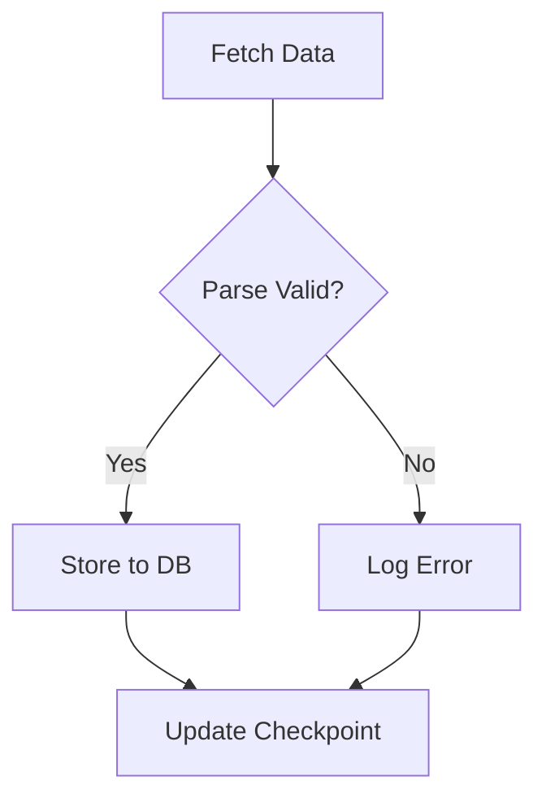
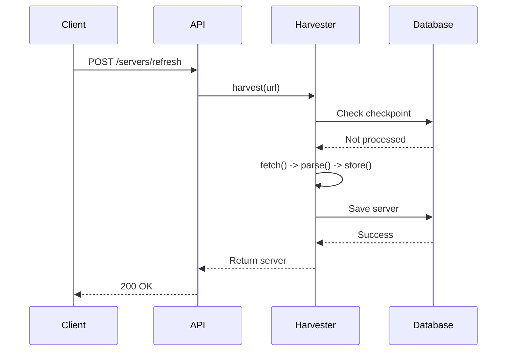
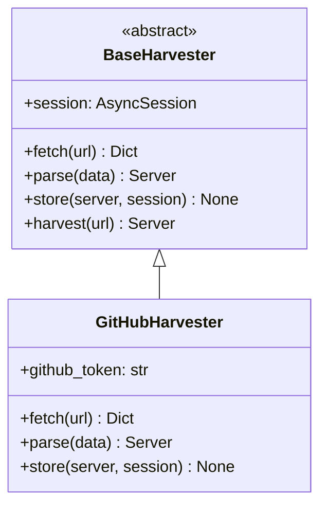
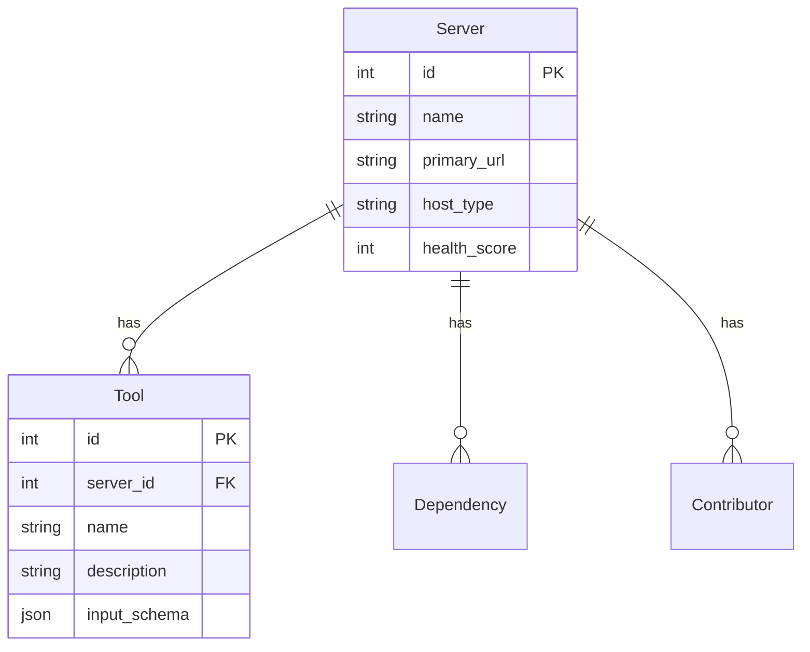

# AGENTS.md - Documentation Authoring Guide

## Context

The `docs/source/` directory contains the Sphinx-based documentation for MCPS. It uses MyST-Parser for Markdown support, autodoc2 for automatic API reference generation, and Mermaid for diagrams.

**Purpose:** Provide comprehensive, searchable documentation for users, developers, and contributors.

**Build System:** Sphinx with shibuya theme, MyST markdown, autodoc2, and various extensions for enhanced documentation capabilities.

## Key Files

| File/Directory | Purpose |
|----------------|---------|
| `conf.py` | Sphinx configuration (all settings) |
| `index.md` | Documentation homepage |
| `installation.md` | Installation guide |
| `quick-start.md` | Getting started tutorial |
| `architecture.md` | System architecture documentation |
| `api/` | Auto-generated API reference (autodoc2) |
| `guides/` | User guides and tutorials |
| `developer-guide/` | Developer documentation |
| `_static/` | Static assets (CSS, images, logos) |
| `_templates/` | Custom Sphinx templates |

## MyST Markdown Conventions

### 1. Document Structure

```markdown
# Page Title

Brief introduction paragraph.

## Section Heading

Content for this section.

### Subsection

More detailed content.

#### Sub-subsection

Even more detailed content.
```

### 2. Cross-References

```markdown
<!-- Link to another document -->
See the [installation guide](installation.md) for setup instructions.

<!-- Link to specific section -->
See [Database Setup](installation.md#database-setup) for details.

<!-- Link to API reference -->
See {py:class}`packages.harvester.core.base_harvester.BaseHarvester` for details.
```

### 3. Code Blocks

````markdown
```python
# Python code with syntax highlighting
from packages.harvester.adapters.github import GitHubHarvester

harvester = GitHubHarvester(session)
server = await harvester.harvest(url)
```

```bash
# Bash commands
uv run pytest
uv run python -m packages.harvester.cli ingest --strategy github
```

```typescript
// TypeScript code
interface Server {
  id: number;
  name: string;
  host_type: string;
}
```
````

### 4. Admonitions

```markdown
:::{note}
This is a note admonition for additional information.
:::

:::{warning}
This is a warning admonition for important cautions.
:::

:::{danger}
This is a danger admonition for critical warnings.
:::

:::{tip}
This is a tip admonition for helpful suggestions.
:::

:::{seealso}
Related documentation:
- [Installation Guide](installation.md)
- [API Reference](api/index.md)
:::
```

### 5. Lists

```markdown
<!-- Unordered list -->
- Item 1
- Item 2
  - Nested item 2.1
  - Nested item 2.2
- Item 3

<!-- Ordered list -->
1. First step
2. Second step
3. Third step

<!-- Task list -->
- [ ] TODO: Task not done
- [x] Done: Completed task
```

### 6. Tables

```markdown
| Column 1 | Column 2 | Column 3 |
|----------|----------|----------|
| Value 1  | Value 2  | Value 3  |
| Value 4  | Value 5  | Value 6  |
```

### 7. Images

```markdown


<!-- With sizing -->
{width=200px}
```

## Mermaid Diagram Usage

### 1. Flowcharts

````markdown

````

### 2. Sequence Diagrams

````markdown

````

### 3. Class Diagrams

````markdown

````

### 4. Entity-Relationship Diagrams

````markdown

````

## autodoc2 Configuration

### 1. Documenting Python Code

Use Google-style docstrings:

```python
def calculate_health_score(
    stars: int,
    forks: int,
    has_readme: bool,
) -> int:
    """Calculate health score from repository metrics.

    This function implements the health scoring algorithm described
    in PRD.md Section 4.1. Scores range from 0-100.

    Args:
        stars: Number of GitHub stars (logarithmic scale)
        forks: Number of repository forks (logarithmic scale)
        has_readme: Whether repository has a README file

    Returns:
        Health score from 0-100

    Raises:
        ValueError: If stars or forks are negative

    Example:
        >>> calculate_health_score(stars=100, forks=20, has_readme=True)
        75
    """
    score = 20  # Base score
    # Implementation...
    return min(100, score)
```

### 2. Class Documentation

```python
class GitHubHarvester(BaseHarvester):
    """GitHub-specific harvester using GraphQL API.

    This harvester implements Strategy A from PRD Section 4.1,
    fetching repository metadata, MCP configurations, and social
    metrics in a single GraphQL request.

    Attributes:
        session: Async database session for operations
        github_token: GitHub API authentication token

    Example:
        >>> async with async_session_maker() as session:
        ...     harvester = GitHubHarvester(session)
        ...     server = await harvester.harvest("https://github.com/owner/repo")
    """

    def __init__(self, session: AsyncSession):
        """Initialize GitHub harvester with session.

        Args:
            session: Async SQLModel session for database operations
        """
        super().__init__(session)
```

### 3. Module-Level Documentation

```python
"""GitHub harvester adapter for MCP servers.

This module implements Strategy A from PRD Section 4.1 "GitHub Strategy
(High Fidelity)". It uses GitHub's GraphQL API to efficiently fetch
repository metadata, MCP configurations, and social metrics in a single
request.

Key Features:
    - Single GraphQL query for all data
    - Automatic retry with exponential backoff
    - Health score calculation
    - Risk level assessment
    - Contributor tracking for bus factor

See Also:
    - PRD.md Section 4.1 for strategy details
    - base_harvester.py for abstract base class
"""
```

## Documentation Structure

### 1. User Documentation

```
docs/source/
├── index.md              # Homepage with overview
├── installation.md       # Installation instructions
├── quick-start.md        # Getting started tutorial
└── user-guide/
    ├── index.md          # User guide overview
    ├── ingesting-data.md # How to ingest data
    ├── querying.md       # How to query data
    └── exporting.md      # How to export data
```

### 2. Developer Documentation

```
docs/source/developer-guide/
├── index.md              # Developer overview
├── architecture.md       # System architecture
├── contributing.md       # Contribution guidelines
├── adding-adapters.md    # How to add new adapters
└── testing.md            # Testing guidelines
```

### 3. API Reference

```
docs/source/api/
├── index.md              # API reference overview
└── generated/            # Auto-generated by autodoc2
    ├── packages.harvester.adapters.md
    ├── packages.harvester.core.md
    └── ...
```

## Examples

### Example 1: Tutorial Page

```markdown
# Ingesting MCP Servers

This tutorial shows you how to ingest MCP servers from various sources.

## Prerequisites

Before you begin, ensure you have:
- Installed MCPS (see [installation guide](installation.md))
- Set up environment variables (see [configuration](configuration.md))
- Initialized the database with `alembic upgrade head`

## Ingesting from GitHub

To ingest a GitHub repository:

\```bash
uv run python -m packages.harvester.cli ingest \
  --strategy github \
  --target https://github.com/modelcontextprotocol/servers
\```

This command will:
1. Fetch repository metadata via GitHub GraphQL API
2. Parse MCP configuration from `mcp.json`
3. Extract tools, resources, and prompts
4. Calculate health score and risk level
5. Store to database with all relationships

:::{tip}
Use your GitHub token for higher rate limits:
\```bash
export GITHUB_TOKEN=ghp_your_token_here
\```
:::

## Ingesting from NPM

For NPM packages:

\```bash
uv run python -m packages.harvester.cli ingest \
  --strategy npm \
  --target @modelcontextprotocol/server-filesystem
\```

See [CLI Reference](cli-reference.md) for all available options.
```

### Example 2: Architecture Documentation

```markdown
# System Architecture

MCPS follows a layered architecture with clear separation of concerns.

## High-Level Overview

\```mermaid
flowchart TB
    subgraph "Data Sources"
        GitHub[GitHub API]
        NPM[NPM Registry]
        PyPI[PyPI API]
    end

    subgraph "Harvester Layer"
        GitHubAdapter[GitHub Adapter]
        NPMAdapter[NPM Adapter]
        PyPIAdapter[PyPI Adapter]
    end

    subgraph "Core Layer"
        BaseHarvester[Base Harvester]
        Database[(SQLite + WAL)]
    end

    subgraph "API Layer"
        FastAPI[FastAPI Server]
    end

    subgraph "Presentation Layer"
        NextJS[Next.js Dashboard]
    end

    GitHub --> GitHubAdapter
    NPM --> NPMAdapter
    PyPI --> PyPIAdapter

    GitHubAdapter --> BaseHarvester
    NPMAdapter --> BaseHarvester
    PyPIAdapter --> BaseHarvester

    BaseHarvester --> Database
    FastAPI --> Database
    NextJS --> Database
\```

## Component Descriptions

### Harvester Layer

The harvester layer implements the polymorphic strategy pattern...

[Continue with detailed descriptions]
```

## Common Tasks

### 1. Add New Documentation Page

**Steps:**
1. Create `.md` file in appropriate directory
2. Add to `toctree` in parent index
3. Write content using MyST markdown
4. Build and verify: `make html`

### 2. Add Mermaid Diagram

**Steps:**
1. Use ` ```mermaid` code block
2. Choose diagram type (flowchart, sequence, class, etc.)
3. Write diagram syntax
4. Preview in Sphinx build

### 3. Update API Reference

**Steps:**
1. Update docstrings in Python code
2. Rebuild docs: `cd docs && make html`
3. Check generated files in `api/generated/`
4. Fix any autodoc warnings

### 4. Add Code Example

**Steps:**
1. Use appropriate language code block
2. Add explanatory text before/after
3. Test code example to ensure it works
4. Add output if relevant

## Testing Documentation

### Build Documentation

```bash
# Build HTML documentation
cd docs && make html

# View in browser
open _build/html/index.html

# Check for warnings
cd docs && make html 2>&1 | grep -i warning

# Clean build artifacts
cd docs && make clean
```

### Check Links

```bash
# Check for broken links
cd docs && make linkcheck
```

### Spell Check

```bash
# Use aspell or similar
find docs/source -name "*.md" -exec aspell check {} \;
```

## Constraints

### MyST Markdown
- **Use valid MyST syntax** - Not all markdown features are supported
- **Test complex syntax** - Some advanced features may not render correctly
- **Check cross-references** - Ensure links resolve correctly

### Mermaid Diagrams
- **Keep diagrams simple** - Complex diagrams may not render well
- **Use consistent styling** - Follow color scheme in conf.py
- **Test rendering** - Some mermaid features may not work in Sphinx

### API Documentation
- **Use Google-style docstrings** - Consistent with project conventions
- **Type hint everything** - autodoc2 uses type hints
- **Add examples** - Make API usage clear

## Related Areas

- **Code Documentation:** See Python files for inline documentation
- **API Guide:** See `apps/api/AGENTS.md` for API endpoint documentation
- **Root Guide:** See `/home/user/mcps/AGENTS.md` for project overview

## Building for Production

```bash
# Build HTML
cd docs && make html

# Build for Read the Docs (automatic)
# Just push to GitHub, RTD builds automatically

# Build PDF (requires LaTeX)
cd docs && make latexpdf
```

## Sphinx Extensions Used

Key extensions configured in `conf.py`:
- **myst_parser** - Markdown support
- **autodoc2** - Automatic API docs
- **sphinxcontrib.mermaid** - Mermaid diagrams
- **sphinx_design** - UI components (cards, tabs)
- **sphinx_copybutton** - Copy code blocks
- **sphinx_tabs** - Tabbed content
- **sphinx_togglebutton** - Collapsible sections
- **sphinxemoji** - Emoji support

## Troubleshooting

### Issue: autodoc2 not generating docs
**Solution:** Check module imports, ensure packages are installed

### Issue: Mermaid diagram not rendering
**Solution:** Check syntax, test in mermaid.live

### Issue: Cross-reference not resolving
**Solution:** Verify target exists, use correct syntax

---

**Last Updated:** 2025-11-19
**See Also:** Sphinx documentation, MyST-Parser documentation, conf.py source
